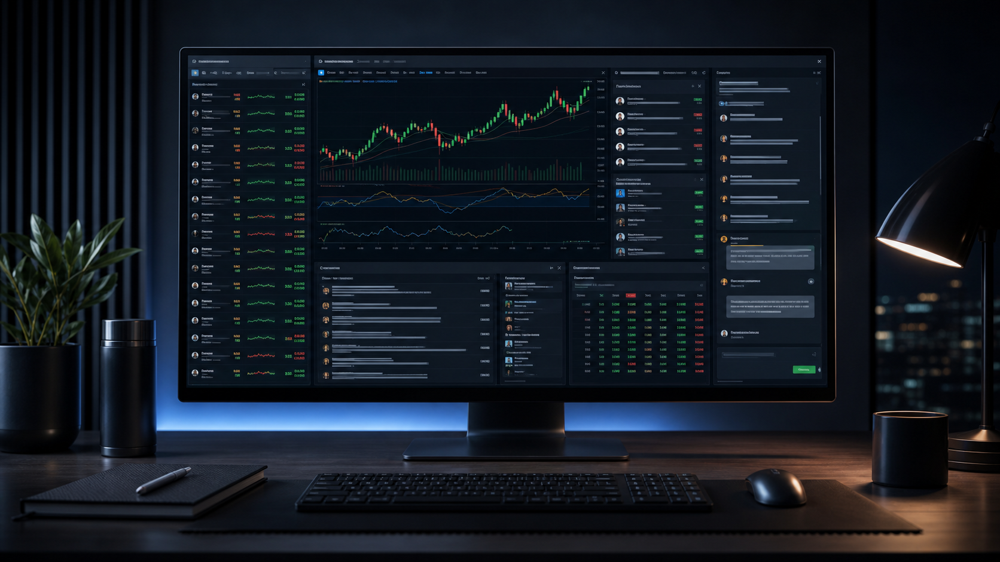
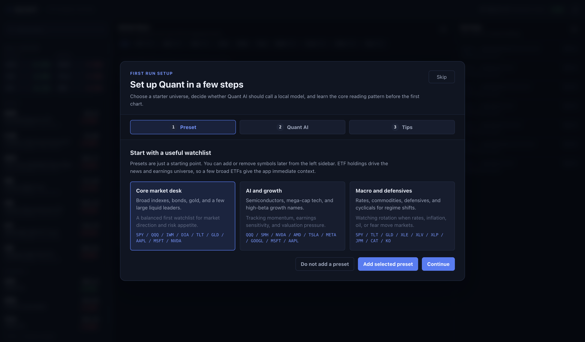
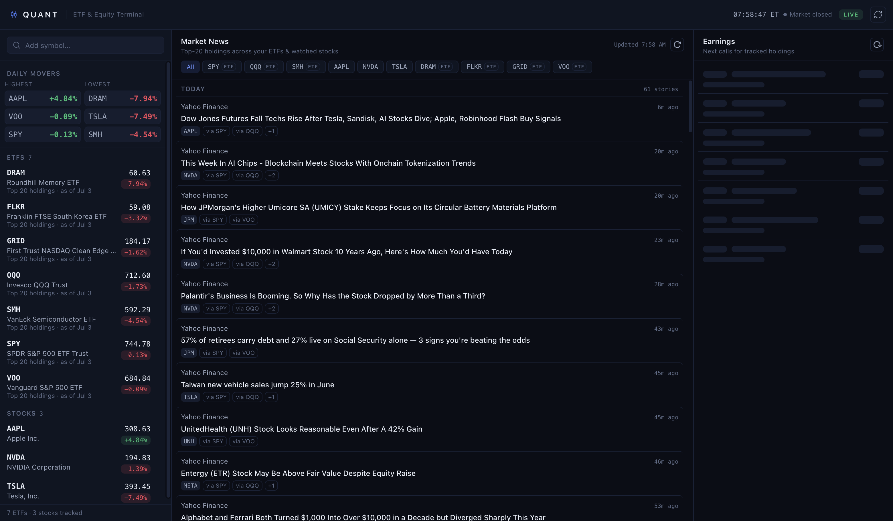
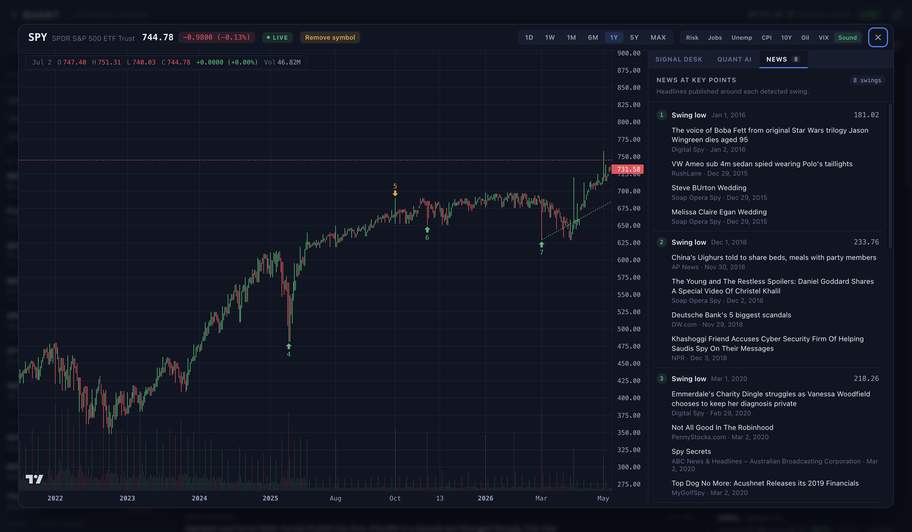
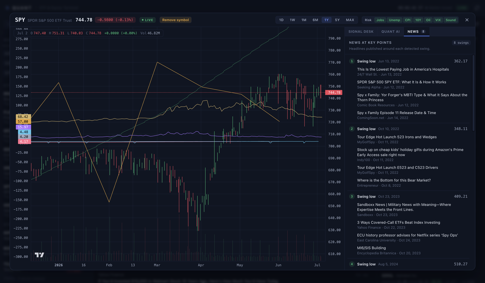
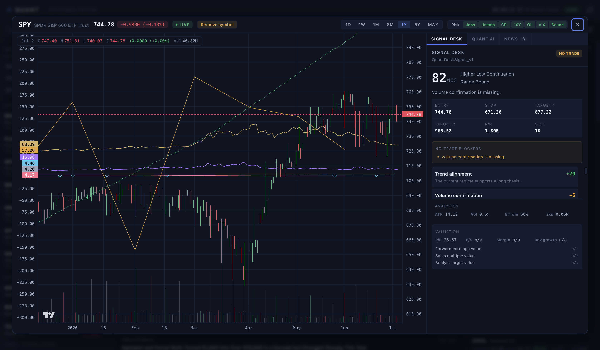
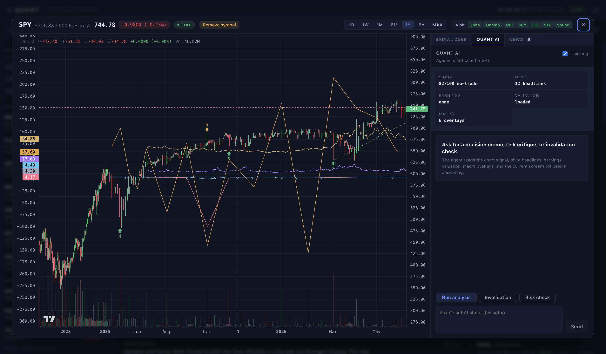
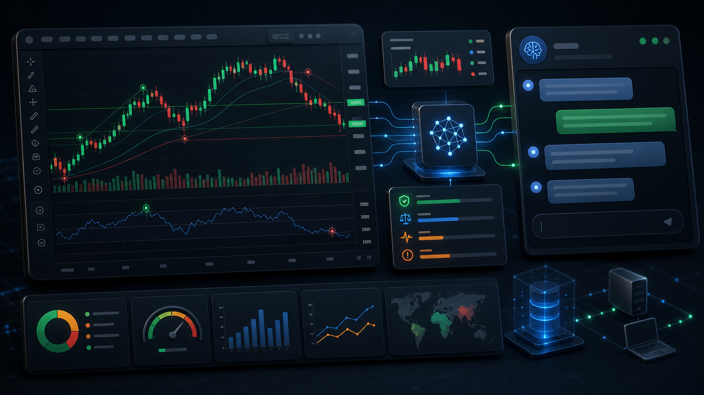

# Quant

Quant is an open-source desktop market terminal for tracking ETFs and stocks. It combines a watchlist, holdings-driven news, earnings context, annotated charts, macro overlays, signal scoring, and an optional local Quant AI agent.

The core promise is simple: useful market context without paid API lock-in. Quant can run with public market data sources, deterministic signal analysis, and a local OpenAI-compatible LLM server when you want AI responses. No cloud LLM API key is required for the default experience.

<p align="center">
  
</p>

<p align="center">
  <a href="https://github.com/eisenjimmy/Quant"></a>
  
  
  
  
</p>

## What Quant Does

Quant is built for quick market scanning:

- Track ETFs and stocks in a desktop watchlist.
- Expand ETF holdings into a broader market universe.
- Read holdings-driven news and upcoming earnings.
- Open a full candlestick chart with pivots, support, resistance, and risk levels.
- Inspect news at each detected swing so price action can be read with the surrounding headline context.
- Toggle macro overlays directly on the chart: jobs, unemployment, CPI, 10Y yield, oil, and VIX.
- Review a deterministic Signal Desk before asking an AI agent.
- Use Quant AI with no paid cloud LLM API cost by staying in deterministic mode or running a local model server.

## Try It

There are two practical ways to try Quant.

### Option 1: Run the Checked-In Release Build

Clone the repository:

```bash
git clone https://github.com/eisenjimmy/Quant.git
cd Quant
```

macOS:

```bash
open release/Quant-mac-arm64/Quant.app
```

Windows PowerShell:

```powershell
.\release\Quant-win-x64\Quant.exe
```

Use `git clone` for the checked-in release folders. The macOS app bundle contains framework symlinks, and git preserves them correctly.

If macOS blocks the unsigned app, open System Settings and allow the app after the first blocked launch. The app is ad-hoc signed for local use but not Apple-notarized.

### Option 2: Run From Source

Requirements:

- Node.js 20 or newer
- npm
- macOS or Windows
- Internet access for live public market data

macOS or Linux shell:

```bash
git clone https://github.com/eisenjimmy/Quant.git
cd Quant
npm install
npm run typecheck
npm start
```

Windows PowerShell:

```powershell
git clone https://github.com/eisenjimmy/Quant.git
cd Quant
npm install
npm run typecheck
npm start
```

`npm start` builds the Electron app and launches the desktop window.

## Screenshots

### First-Run Onboarding

The onboarding wizard helps a new user choose a starter watchlist, decide whether to enable local LLM calls, and understand the basic reading flow.



### Market Dashboard

The main screen keeps the app dense and practical: watchlist on the left, holdings-driven news in the center, and earnings context on the right.



### Chart Modal and Signal Desk

Opening a symbol brings up the full chart workspace: candlesticks, volume, pivots, risk levels, deterministic signal scoring, valuation context, and earnings context.



### News at Each Swing

Quant detects swing highs and swing lows, numbers the key points, and groups headlines published around each swing. The goal is to make price movement explainable: a user can click through the swing list and compare chart pivots against the news available near that date.



### Macro Overlay System

Quant can layer multiple macro series directly over the active price chart. This is useful when a setup depends on rates, labor data, inflation, oil, volatility, or broad risk appetite.



Available chart overlays:

| Overlay | Why It Matters |
| --- | --- |
| Jobs | Frames economic momentum and sector rotation risk |
| Unemployment | Helps identify labor-cycle stress or late-cycle cooling |
| CPI | Connects inflation pressure to rates, margins, and multiples |
| 10Y yield | Acts as a discount-rate anchor for equity and ETF valuation |
| Oil | Affects energy, transport, inflation, and consumer-margin pressure |
| VIX | Shows market fear, expected volatility, and stop-width regime |
| Risk | Draws entry, stop, target, and position sizing context |

### Quant AI Agent

Quant AI is a dedicated chart tab. It hydrates the current symbol, chart range, signal evaluation, risk plan, pivot-linked news, earnings, valuation, active macro overlays, and chart screenshot context before producing a memo.



## Local AI With Zero Cloud LLM API Cost

Quant AI does not require a paid cloud model provider.

You have three modes:

| Mode | Setup | Cloud LLM API Cost | Behavior |
| --- | --- | --- | --- |
| Deterministic fallback | None | `$0` | Quant returns a rules-based memo from the signal engine |
| Local LLM | Run LM Studio, llama.cpp, Ollama OpenAI mode, or a proxy | `$0` | Quant sends chart context to your local OpenAI-compatible server |
| Disabled | Leave local LLM off | `$0` | The AI tab remains usable through deterministic analysis |

Expected local server endpoints:

- `GET /health`
- `POST /v1/chat/completions`

Example local setup:

```bash
export QUANT_LLM_ENABLED=1
export QUANT_LLM_BASE_URL=http://127.0.0.1:8080
export QUANT_LLM_MODEL=your-local-model-name
npm start
```

Windows PowerShell:

```powershell
$env:QUANT_LLM_ENABLED="1"
$env:QUANT_LLM_BASE_URL="http://127.0.0.1:8080"
$env:QUANT_LLM_MODEL="your-local-model-name"
npm start
```

You can also configure this through onboarding. Saved LLM preferences are stored in Electron local app data as `llm-settings.json`.

## Feature Map

| Area | Capability |
| --- | --- |
| Watchlist | Add ETFs or stocks, see prices, daily movers, and grouped ETF/stock sections |
| ETF holdings | Expand ETF holdings so news and earnings cover underlying companies |
| News | Pull public finance headlines and group them by selected market universe |
| Swing news | Group headlines around each detected chart swing high or swing low |
| Earnings | Show upcoming earnings for watched names and ETF holdings |
| Charts | Candlesticks, volume, ranges, pivots, support/resistance, risk overlay |
| Macro overlays | Jobs, unemployment, CPI, 10Y yield, oil, VIX |
| Signal Desk | Deterministic setup classification, confidence, blockers, risk plan |
| Quant AI | Agentic chat tab over chart, signal, news, earnings, valuation, macro context |
| Local persistence | Watchlist, saved Quant AI insights, LLM settings |
| Release builds | Runnable macOS and Windows folders under `release/` |

## Generated Showcase Visual

The image below is generated artwork for the README. It is not a literal app screenshot; the real screenshots above show the actual running UI.



## Data Sources

Quant uses free public endpoints and bundled fallback data:

- Yahoo Finance chart, quote, search, valuation, and earnings endpoints
- Yahoo Finance RSS feeds
- Google News RSS
- FRED CSV endpoints for selected macro overlays
- Bundled sample chart, holdings, quote, news, and earnings data

No API key is required for the default experience.

Important limitations:

- Public endpoints can change, throttle, or fail.
- Data can be delayed, approximate, incomplete, or unavailable.
- Free endpoints should not be treated as trading infrastructure.
- `SAMPLE` badges mean bundled fallback data is being shown instead of live data.

## Repository Structure

```text
Quant/
  src/
    main/
      main.ts                 Electron lifecycle, window setup, IPC handlers
      preload.ts              Secure typed bridge exposed as window.quant
      services/
        chart.ts              Historical chart data loading
        earnings.ts           Earnings calendar data
        holdings.ts           ETF holdings lookup
        insightStore.ts       Saved Quant AI insight records
        llmSettings.ts        Optional local LLM settings persistence
        macro.ts              Jobs, unemployment, CPI, 10Y, oil, VIX overlays
        news.ts               Market news aggregation
        pivotNews.ts          News grouped around chart pivots
        quantAi.ts            Local LLM or deterministic Quant AI memo
        quotes.ts             Watchlist quote data
        valuation.ts          Valuation snapshot and formula estimates
      data/
        etf-holdings.json     Offline holdings fallback
        symbol-directory.json Offline symbol search fallback
    renderer/
      App.tsx                 App shell
      store.tsx               Watchlist, quotes, holdings, modal state
      components/
        OnboardingWizard.tsx  First-run setup wizard
        ChartModal.tsx        Main chart workspace
        NewsFeed.tsx          Holdings-driven news panel
        Watchlist.tsx         Watchlist and movers panel
        chart/
          ChartCanvas.tsx     Lightweight Charts rendering
          QuantAgentPanel.tsx Agentic Quant AI chat UI
          QuantDecisionPanel.tsx Deterministic Signal Desk
          useMacroOverlays.ts Macro overlay data hook
      styles/                 App, chart, watchlist, news, earnings CSS
    shared/
      ipc.ts                  IPC channel names
      types.ts                Shared API and market data contracts
      quant.ts                Deterministic signal engine
  scripts/
    build.mjs                 esbuild bundle script
    package-release.mjs       Runnable macOS and Windows release builder
    test-quant.mjs            Signal-engine tests
  docs/
    assets/
      screenshots/            Real app screenshots used in this README
      showcase/               Generated public repo visuals
  release/
    Quant-mac-arm64/          Runnable macOS app folder
    Quant-win-x64/            Runnable Windows x64 app folder
```

## Architecture

Quant uses a standard Electron split:

| Layer | Path | Responsibility |
| --- | --- | --- |
| Main process | `src/main` | Fetches remote data, owns persistent stores, handles IPC, opens external URLs |
| Preload bridge | `src/main/preload.ts` | Exposes a typed, narrow `window.quant` API to the renderer |
| Shared types | `src/shared` | IPC contracts, market data models, deterministic signal engine |
| Renderer | `src/renderer` | React UI, chart rendering, app state, onboarding, agent UI |
| Build scripts | `scripts` | Build, tests, smoke screenshots, release packaging |

The renderer does not directly call remote market endpoints. It asks the Electron main process through the preload bridge. That keeps network access, filesystem writes, local LLM calls, and external link opening in the main process.

## Common Commands

| Command | Purpose |
| --- | --- |
| `npm run build` | Bundle Electron main, preload, renderer, and static data into `dist/` |
| `npm run typecheck` | Run TypeScript type checking without emitting files |
| `npm run test:quant` | Run deterministic signal-engine tests |
| `npm start` | Build and launch the desktop app |
| `npm run smoke` | Build, launch in smoke mode, and write `dist/smoke.png` |
| `npm run smoke:modal` | Build, launch with the SPY chart modal open |
| `npm run package:mac` | Build a runnable macOS app folder in `release/` |
| `npm run package:win` | Build a runnable Windows x64 app folder in `release/` |
| `npm run package:all` | Build macOS and Windows release folders |

## Release Packaging

Quant includes a lightweight release packager at `scripts/package-release.mjs`. It does not require electron-builder.

The packager:

1. Runs `scripts/build.mjs`.
2. Creates a minimal Electron app payload under `resources/app`.
3. Copies the compiled `dist/` payload.
4. Writes a minimal runtime `package.json`.
5. Copies `LICENSE` and `AUTHORS.md` into the packaged app.
6. Produces runnable release folders under `release/`.

Build both release folders:

```bash
npm run package:all
```

Outputs:

```text
release/Quant-mac-arm64/Quant.app
release/Quant-win-x64/Quant.exe
```

The Windows folder must be distributed as a folder. Do not distribute `Quant.exe` alone because it depends on adjacent Electron runtime files.

## Troubleshooting

### `npm start` opens no window in VS Code on Windows

Some VS Code terminals set `ELECTRON_RUN_AS_NODE`, which can make Electron behave like Node instead of launching a window.

PowerShell:

```powershell
Remove-Item Env:ELECTRON_RUN_AS_NODE -ErrorAction SilentlyContinue
npm run build
& ".\node_modules\electron\dist\electron.exe" .
```

### Local LLM cannot connect

Check the local model server:

```bash
curl http://127.0.0.1:8080/health
```

Then confirm the environment variables are set in the same shell that launches Quant.

To reopen onboarding:

```bash
./node_modules/.bin/electron . --onboarding
```

To reset saved LLM preferences, remove `llm-settings.json` from Electron's `userData` directory and launch Quant again.

## Security Model

- Renderer loads local app files.
- Content Security Policy blocks arbitrary remote connections from the renderer.
- Main process validates external URLs before opening them.
- Market data and news are treated as untrusted remote content.
- Local LLM calls are disabled by default.
- No secrets are required for default operation.
- Treat market output as informational context, not execution advice.

## Credits

Original code by David Wong, username `DavidWProject`.

## Contributing

See `CONTRIBUTING.md`.

## Security

See `SECURITY.md`.

## License

MIT. See `LICENSE`.

## Disclaimer

Quant is for research, education, and personal market monitoring. It is not investment advice, a broker, an execution system, or a source of guaranteed real-time market data.
